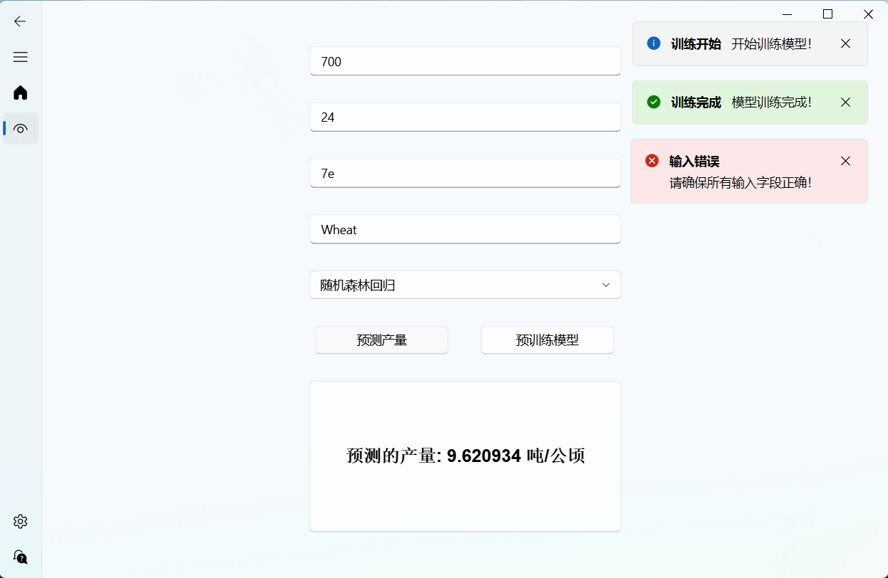
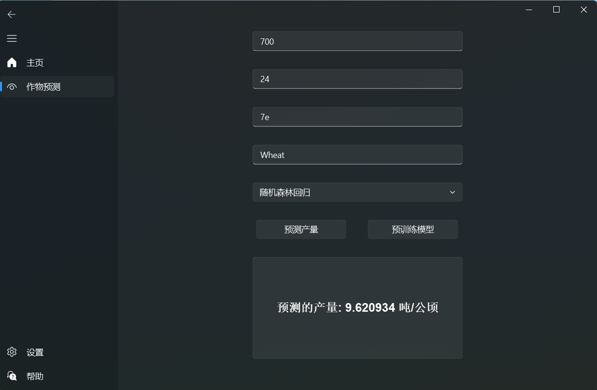

# crops_predict
python写的一个pyside6程序,实现了作物产量的预测

## 一、项目简介

**基于气象和土壤数据的作物产量预测**：收集历史气象数据（温度、降水等）、作物信息、土壤数据和相应的作物产量数据，运用回归分析、机器学习算法构建产量预测模型

## 二、项目技术

1.数据挖掘

2.机器学习

3.sklearn

4.pyside6

## 三、项目功能

输入四个指标可以进行预测产量

训练结果在底部标签框展示

点击预测产量后会自动加载对应的模型

点击预训练模型会训练同一模型下的所有作物模型

## 四、实现过程

> 1.收集数据 使用数据集 product\_regressiondb.csv
> 
> 2.数据探索 画可视化图
> 
> 3.数据预处理 缺失值 重复值 异常值
> 
> 4.画相关图 找特征
> 
> 5.找模型 根据mse mae 准确度 判断好坏 随机森林效果最好
> 
> 6.模型优化 根据粒子群优化算法找超参数 优化 xgboot和cart决策树
> 
> 7.预测
> 
> 8.使用pyside6构建预测界面

在数据收集阶段，我使用了提供的数据集 product\_regressiondb.csv。该数据集中包含了影响作物产量的重要变量，包括气象数据（如温度、降水量和日照时间）以及土壤养分数据等。此外，数据集中还包含目标变量，即作物的产量。这一数据为模型构建提供了全面的输入信息。在完成数据导入后，我首先对数据的基本结构进行了检查，包括数据的行数、列数、数据类型、空值比例以及变量的初步统计特性。这一步骤让我迅速熟悉了数据集的基本情况，同时也发现了存在的问题，如缺失值、重复值和潜在的异常值。

在数据探索阶段，我通过可视化技术对数据进行分析。利用 Matplotlib可视化工具，我绘制了变量的分布图、散点图和箱线图，从不同角度观察数据的特性。例如，我发现作物产量与降水量之间存在一定的非线性关系，而日照时间和温度的影响较弱。同时，通过箱线图发现了一些异常值，这些异常值需要在后续的数据预处理中妥善处理。相关性分析也在这个阶段展开，通过绘制相关性热力图，我确认了几个关键特征变量与作物产量的强相关性，为后续特征选择提供了明确方向。

数据预处理是重要环节。首先，我通过 isnull 方法检查了数据中的缺失值，并采用均值填充的方法处理了数值型缺失数据。这种方式既保证了数据的完整性，又避免了因数据缺失带来的潜在偏差。其次，我使用 drop\_duplicates 方法去除了数据中的重复记录，以确保模型的训练数据真实有效。对于异常值，我采用了 Z-score 方法进行筛选，通过计算每个数据点的标准差偏离程度，将超过设定阈值的数据视为异常值并剔除。这些处理步骤显著提高了数据的质量，为模型的准确性奠定了基础。

在特征选择环节，我重点分析了变量与目标变量的相关性。通过相关性热力图，我选择了温度、降水量和PH作为主要特征变量,根据作物种类训练模型。

模型选择与评估是本次设计的核心部分。在这一阶段，我尝试了多种模型，包括随机森林、XGBoost 和 CART 决策树。通过将数据集划分为训练集和测试集，我分别对这些模型进行了训练和测试。为了评估模型的性能，我使用了多种指标，包括均方误差（MSE）、平均绝对误差（MAE）以及预测准确度。最终，通过对比发现，随机森林在大多数指标上的表现最优，具有较高的稳定性和预测精度，因此被选为最佳基础模型。

为了进一步提升模型性能，我对 XGBoost 和 CART 决策树模型进行了超参数优化。通过引入粒子群优化（PSO）算法，我能够在多个超参数维度上自动搜索最佳参数组合。PSO 的核心思想是通过模拟粒子在解空间中的移动，寻找最优解。在这次优化中，我主要对 XGBoost 的学习率、最大深度和树的数量以及 CART 决策树的分裂准则和最大深度进行了优化。优化后的模型在 MSE 和 MAE 等指标上取得了显著提升，预测结果更加准确。这一过程让我深刻认识到超参数优化在提升模型性能方面的关键作用。

在模型预测阶段，我分别使用了随机森林、原始 XGBoost、原始 CART 决策树以及优化后的 XGBoost 和 CART 决策树对作物产量进行了预测。通过对比不同模型的预测结果，我发现优化后的模型具有更高的精度，特别是在复杂数据分布下的表现尤为突出。此外，通过与实际值的对比，我总结了模型可能的误差来源，为未来的改进提供了方向。

最后一部分是预测界面的构建。我使用 PySide6 开发了一个简单易用的图形界面。界面包括预测按钮和结果显示区域。在界面开发的过程中，我学习了如何将后端的预测逻辑与前端用户交互相结合，同时也积累了关于用户体验设计的实践经验。

## 五、预测界面

